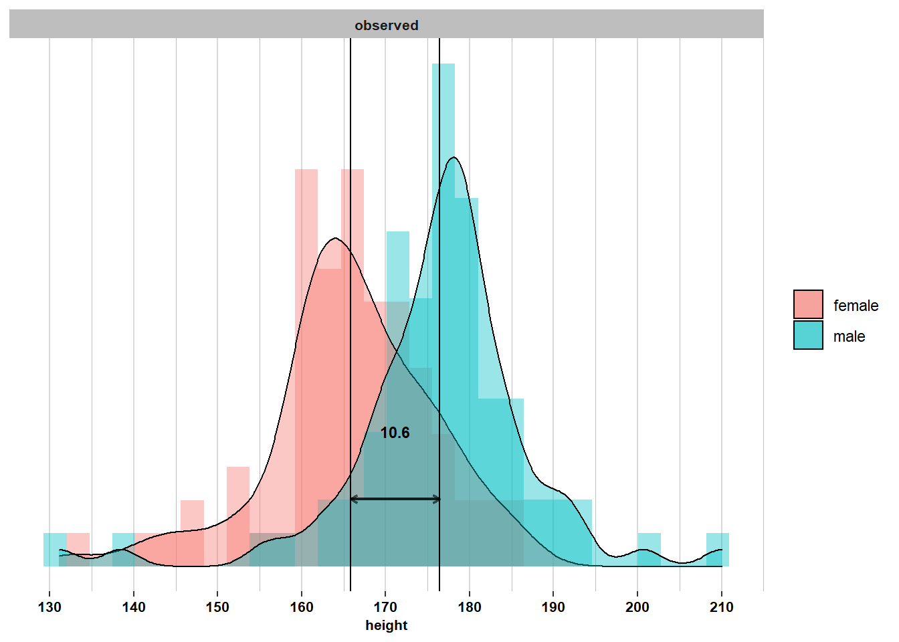
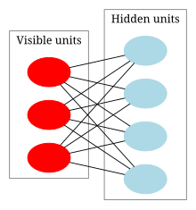

# Restricted Boltzman Machine :

This is a personal implementation of a RBM-model, trained to do a generative-image task.

such models approxiamte the underlying distribution probability of a dataset.

We use binary images here, but the work is applicable to RGB-values images as well :

### Mathematical-Formulation

Let $V$ the random variable that underlies our data distribution that lives in the space $\set{0,1}^p$ \*we can see the image as a big vector where p = hxw$.
such distribution is by nature much difficult, and leverage multimodality behaviours, supposing some hard constraint about the distribution (i.e being some gaussian) is in vain.
In the generative AI formulations, authors propose to go through some intermediate hidden random variable $H$ that lives in a relatively other space $\set{0,1}^q$ when coupled to it, and explains $V$ since it's coupled to it.

For example : take the height distribution inside a population, the estimated distribution is a mono-modal Gaussian, which parameters aren't easy to estimate, but whith conditioning over the random variable $X(\omega) = \set{male, female} $, the distribution becomes an easy Gaussian, we estimate the parameters of each gaussian seperatly.

Once $V$ is found, we can easily substitue the $p_V$ distrbution by marginaliziong over $p_H$. but such task isn't that easy for complexe phenomenon.

The RBM formulation relies on the following model :

$p{\theta}(h|v) = e^{-E*\theta(v,h) / Z(\theta)}$ where $E\_\theta(v,h) = a^T v + b^T h v^T W h$. and $\theta = \set{a \in R^p, b \in R^q, W \in R^{pxq}}$ the set of parameters of the to find.

This formulation benefits from such mathematical properties, as $h$ being conditionly independent to $v$, the inverse is also true, whoch helps for sampling later.

techniques such Gibbs-Sampling are used to sample from distribution to make it computationally feasible.

### Finale Note :

this relies purely on mathematicall results, and is implemented using only numpy package, isn't it interesting :D
